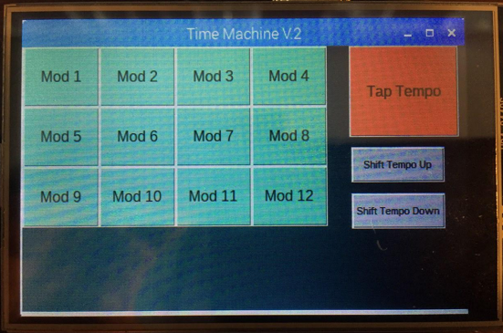

# TimeMachine Python

### Overview 
This is the Python code used to create a touch screen GUI on the Raspberry Pi 3. This is an Object-Oriented approach using Python. This code is broken into several sections. There are sections for Variables, Classes, Functions, and Main. The GUI has 12 different on-screen touch button modules, each corresponding with the 12 different push buttons on the Arduino Button Pad. The user selects the physical button they want to program on the touch screen. This will bring up an effects selection menu where the user chooses an effect. When the user selects an effect, it will bring the user back to the main menu, where they can program the other buttons. The chosen effect is associated with a unique ASCII character. All effects have their own ASCII character identifier. When an effect is chosen, its unique ASCII identifier is then associated with the input from the Arduino Button Pad. The Raspberry Pi 3 is programmed to send the associated character to the OMAP, via USB, when an input is received from the Button Pad. Inputs from the Arduino Button Pad are received as numbers, received via USB. The chosen effect is associated with this number identifier. There is a Tap Tempo and and Tempo Up buttons on the Main Menu screen as well. These also have their own ASCII identifiers as well. They send a character when pressed on screen. Each button Mod has its own effect selection menu page when pressed. This system allows the user to be able to arrange the effects how ever they like on the Button Pad, giving more creative freedom. 

# Files
Python/TimeMachine2.PY
- initialize serial
- create variables for programButton
- create read serial function, check input from Arduino Button Pad
- create logic for Tap Tempo, Tempo Up, Tempo Down touch button press
- create logic for each Mod Button touch button press
- create logic for Effect Selection  touch button press
- create Main Class: creates the "book frame" of the GUI and allows pages to be changed
- create Main Menu page class, with all the touch screen objects
- create Effects Pages for each of the 12 Mods
- end program 