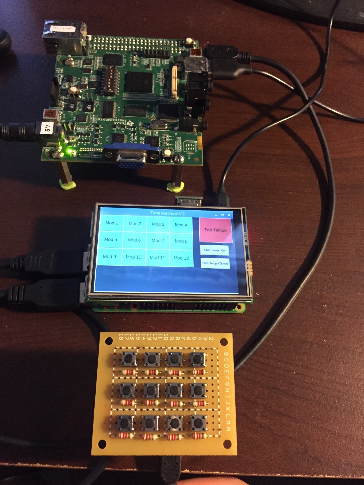

# Time Machine

### Introduction

Time Machine is a Dynamic Delay-Based Audio Effects Module that can alter and remix audio in real time. Anybody can sound like a professional DJ with this machine. Time Machine is a powerful tool that can perform momentary repeat loops, rearrange the rhythm, change playback speed, reverse, stutter, vinyl scratch effects, flanger effects, and other DJ effects over a 4 beat sequence. A 12 push button pad is used to activate the effects. Effects and their respective buttons are selected by a touch screen GUI. The layout can be configured in any order. A Tap Tempo on the touch screen GUI is used in order to synchronize the device BPM (beats per minute) to the BPM of any song that is played through it. There are 25 different audio effect sequences to choose from. A music source and a speaker are plugged into 3.5mm audio input and output jacks. This is a working prototype programmed using Python, C, and C++. Inspiration for this machine came from a VST Plug-In called Gross Beat by Image Line. 

### Hardware

- **Texas Instruments OMAP-L138 LCDK** - Performs all of the Digital Signal Processing operations, receives commands from the Raspberry Pi 3, and performs dynamic delay-based audio effects

- **Raspberry Pi 3** - Used to create the touch screen GUI, receives commands from the Arduino Nano, and sends commands to the OMAP-L138 LCDK via USB 

- **Arduino Nano** - Used to create the 12 button push button pad and send messages to the Raspberry Pi 3 via USB

- **Uctronics 3.5 inch TFT touch screen** - Goes ontop of the Raspberry Pi 3 and is the touch screen for the device

### Folders and Purpose

- **TimeMachine/Arduino** - Contains C++ code written in order to program the Arduino Nano

- **TimeMachine/DSP** - Contains the C code used for the TI OMAP-L138 Low Cost Development Kit (LCDK)

- **TimeMachine/Python** - Contains Python code used to program the Raspberry Pi 3
